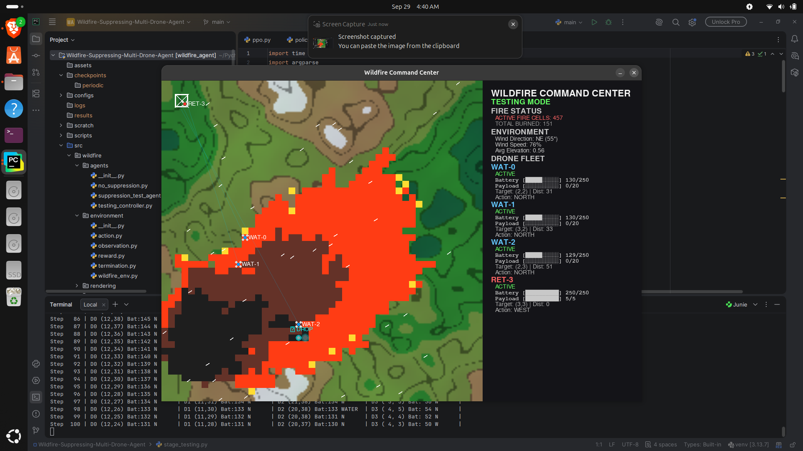
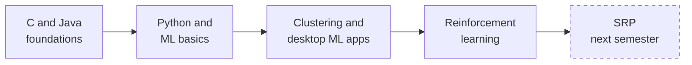

 

## ✨ About me

I'm a 5th semester B.Tech CSE (AI) student at **TKM College of Engineering**. I like turning ML ideas into things that actually run: simulations, web apps and desktop tools. I've led the team on every college project.

Right now I'm:

- 🧹 polishing my older projects
- 🧠 learning new AI tools and wiring them into my work
- 🌍 getting ready for my SRP (socially relevant project) next semester

## 🛠️ Tech I use

  
  
  
  
  

  
  
  
  
  

  
  
  
  
  

Also: Matplotlib, K-Means, PCA, Reinforcement Learning (PPO), Gymnasium, PyGame, JavaFX, PyCharm.

## 🚀 Featured projects

<table>
  <tr>
    <td width="50%" valign="top">
      <h3>🔥 Wildfire Drone Swarm</h3>
      A multi-drone agent trained with PPO to suppress wildfires on its own. Covers drone navigation, resource limits, reward design and simulation-based training.  
      <code>Python</code> <code>PPO</code> <code>Gymnasium</code> <code>PyGame</code>  
      <a href="https://github.com/Mohd-Hanan/REPLACE_WITH_REPO_NAME">Code</a>
      <!--   -->
    </td>
    <td width="50%" valign="top">
      <h3>🛒 Customer Segmentation</h3>
      Streamlit app that groups customers with K-Means (k = 2 to 6), draws PCA plots and predicts a new customer's segment in real time.  
      <code>Python</code> <code>Scikit-learn</code> <code>Streamlit</code>  
      <a href="https://github.com/Mohd-Hanan/IML-PROJECT">Code</a> · <a href="https://YOUR-APP.streamlit.app">Live demo</a>
      <!--   -->
    </td>
  </tr>
  <tr>
    <td width="50%" valign="top">
      <h3>⚡ PowerGuard</h3>
      JavaFX desktop app that predicts electricity bills, benchmarks 5 ML models on 10,000 records, tracks budgets and exports PDFs.  
      <code>Java</code> <code>JavaFX</code> <code>ML</code>  
      <a href="https://github.com/Mohd-Hanan/AP-PROJECT">Code</a>
      <!--   -->
    </td>
    <td width="50%" valign="top">
      <h3>🗓️ FIH</h3>
      A personal planner with to-do lists and goals, built with a friend for our personal use.  
      <code>TypeScript</code>  
      <a href="https://github.com/Mohd-Hanan/MY-PLANNER">Code</a>
    </td>
  </tr>
  <tr>
    <td colspan="2" valign="top">
      <h3>🌐 Portfolio</h3>
      My personal site, and a project I keep updating.  
      <code>TypeScript</code> <code>Vercel</code>  
      <a href="https://github.com/Mohd-Hanan/PORTFOLIO">Code</a> · <a href="https://hanan-portfolio-ten.vercel.app">Live site</a>
    </td>
  </tr>
</table>

## 🗺️ My path so far

## 🏅 Certifications

- 3 NPTEL course certifications
- Workshop participation certificates
- 1 hackathon participation (more to come 😅)

## 📬 Let's connect

  
  

